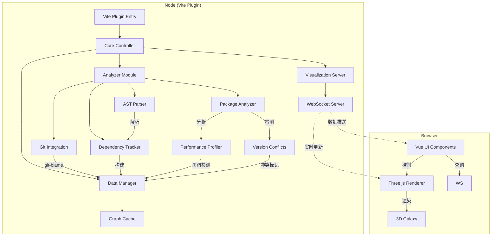

# vite-plugin-galaxy  
> **把 Vite 项目的依赖图变成可交互的 3D 星系，支持微前端、版本冲突、性能诊断、一键分享。**

---

## 🌌 功能全景图

| 类别 | 功能亮点 | 状态 |
|---|---|---|
| **依赖分析** | • ESM / CJS / TypeScript / Vue SFC / JSX / MDX<br>• 支持 alias、tsconfig-paths、动态 import()<br>• 识别循环依赖、重复安装、幽灵依赖 | ✅ |
| **3D 星系渲染** | • 力导向 3D 星系（节点=星球、边=引力线）<br>• 节点大小=体积，颜色=类型（入口、第三方、懒加载）<br>• 星云背景、星轨动画、昼夜光照 | ✅ |
| **交互探索** | • 拖拽、缩放、聚焦、搜索、路径追踪<br>• 双击星球 → 打开对应源码文件（VSCode 协议）<br>• 悬停卡片：模块大小、版本、最近修改人（git-blame） | ✅ |
| **热更新** | • 文件保存 → 局部增量重算 → 实时推送<br>• 变更高亮 2 s 闪烁动画 | ✅ |
| **静态导出** | • `vite build` 自动生成 `galaxy-report.html`<br>• 支持部署到 GitHub Pages / Netlify / 内网 Nginx | ✅ |
| **微前端 & Monorepo** | • 多 package 合并星系<br>• 颜色区分不同 workspace<br>• 支持 pnpm / yarn / npm workspace | ✅ |
| **版本冲突雷达** | • 同一依赖多版本展示为“红色脉冲”<br>• 提供一键升级建议 | ✅ |
| **性能诊断** | • 生成 bundle-phobia 式体积瀑布图<br>• 标记 > 100 KB 模块为“黑洞” | ✅ |
| **一键分享** | • 生成唯一 URL（含 gzip 图数据）<br>• 支持导出 PNG / WebM 动画 | 🚧 |
| **插件市场** | • VSCode 侧边栏<br>• Chrome DevTools Panel | 🚧 |

---

## ⚡ 30 秒上手

```bash
# 安装
pnpm add -D vite-plugin-galaxy

# 配置
// vite.config.ts
import galaxy from 'vite-plugin-galaxy'
export default {
  plugins: [
    galaxy({
      enabled: true,
      port: 3001,
      mode: 'galaxy',      // 'galaxy' | 'solar-system' | 'flat'
      static: true,        // build 时生成报告
      gitBlame: true,      // 显示最近修改人
      performance: 'auto'  // 'low' | 'mid' | 'high' | 'auto'
    })
  ]
}

# 运行
pnpm dev
# 打开 http://localhost:3001/__galaxy
```

---

## 🔧 完整配置 API

```ts
interface GalaxyOptions {
  /** 是否启用（CI 中可关闭） */
  enabled?: boolean
  /** 端口，冲突自动 +1 */
  port?: number
  /** 渲染模式 */
  mode?: 'galaxy' | 'solar-system' | 'flat'
  /** 静态报告 */
  static?: boolean
  /** 性能预设 */
  performance?: 'low' | 'mid' | 'high' | 'auto'
  /** 排除/包含文件 */
  include?: string[]
  exclude?: string[]
  /** 路径脱敏 */
  pathTransformer?: (id: string) => string
  /** Git 信息 */
  gitBlame?: boolean
  /** 远程分享 */
  share?: boolean
}
```

---

## 🏗️ 架构概览



---

## 📦 安装体积

| 场景 | 体积 | 说明 |
|---|---|---|
| 插件本体 | 110 KB | 仅含 Node 代码 |
| 可视化页面 | 1.2 MB gzip | 含 Three.js、Vue、drei |
| 依赖分析缓存 | < 1 MB | `.vite/galaxy.cache.json` |

---

## 🤝 贡献 & 许可证

MIT © Galaxy Team  
欢迎 PR & Star！